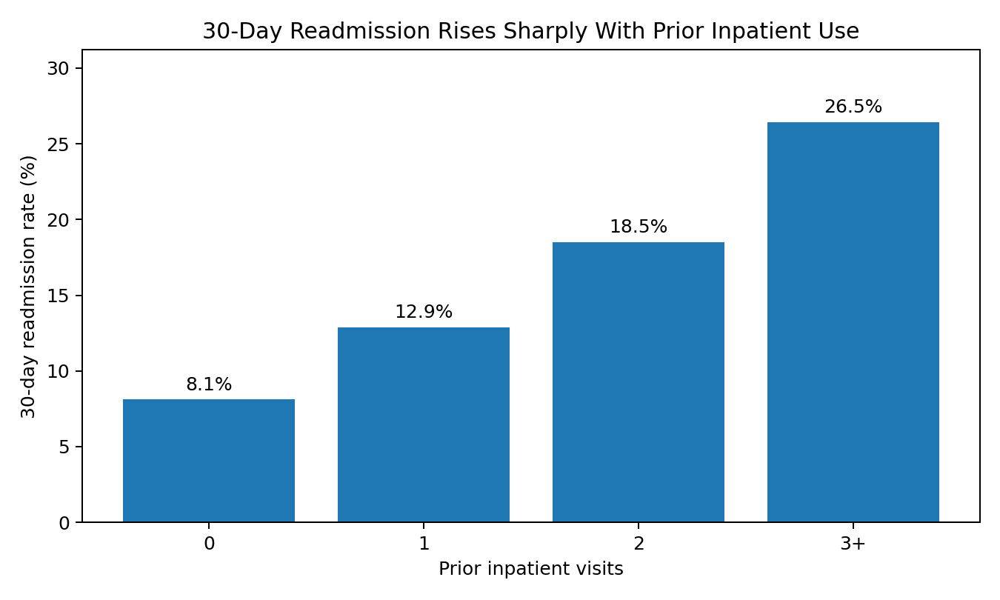
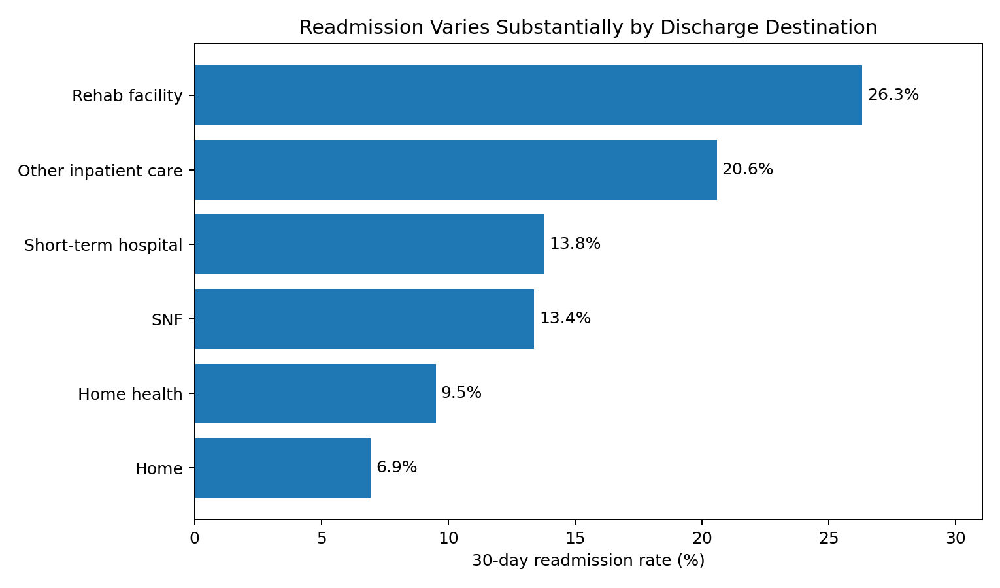
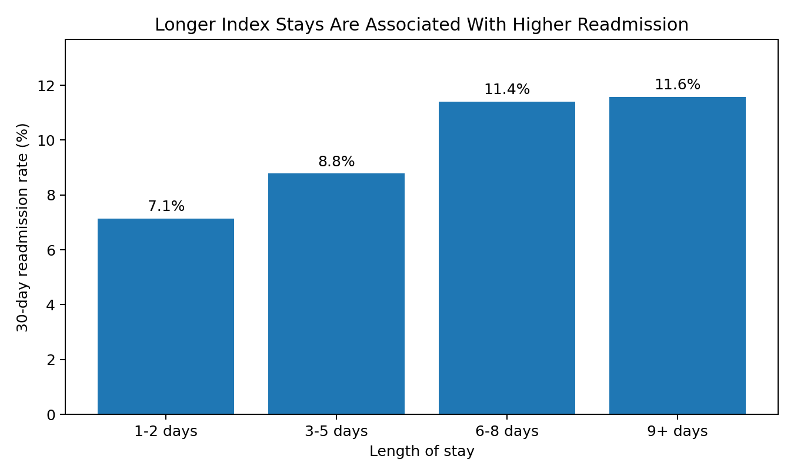
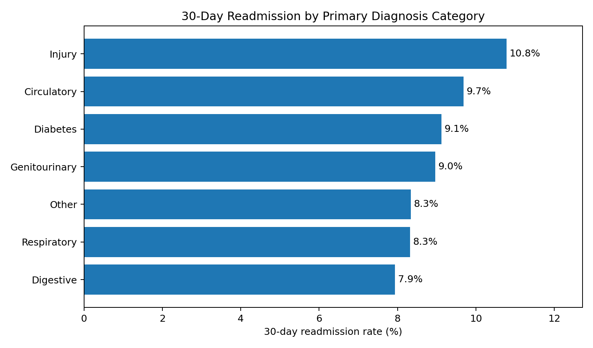

<h1 align="center">Hospital Readmission Risk Analysis</h1>

<p align="center">
A SQL-based analysis of early readmission among patients with diabetes across 130 U.S. hospitals and integrated delivery networks.
</p>

## Executive Summary

This project analyzes the **Diabetes 130-US Hospitals for Years 1999-2008** dataset to identify encounter-level characteristics associated with readmission within 30 days. After retaining each patient's first recorded encounter and excluding discharge dispositions where subsequent readmission was not a meaningful outcome, the analytic cohort contained **69,973 patients**. Of these, **6,277 (9.0%)** were readmitted within 30 days.

The strongest descriptive signal was **prior inpatient utilization**: patients with 3+ prior inpatient visits had a **26.5% 30-day readmission rate** versus **8.1%** among patients with no prior inpatient visits — an absolute difference of **18.3 percentage points** and a **3.26x relative rate**. Discharge destination showed an equally important risk gradient: patients discharged to a rehabilitation facility had a **26.3%** readmission rate compared with **6.9%** among patients discharged home.

These findings suggest that a practical readmission surveillance workflow should prioritize **recent healthcare utilization and post-acute discharge needs first**, then use length of stay, age, medication burden, and diagnostic complexity as secondary escalation signals.

## Business Context

Thirty-day readmission is an important quality and utilization metric because early returns to the hospital may reflect disease severity, gaps in care transitions, incomplete follow-up, or complex social and clinical needs. In current U.S. policy, CMS reduces payments to eligible hospitals with excess risk-standardized readmissions for specific conditions and procedures through the Hospital Readmissions Reduction Program (HRRP).

This dataset is not a direct HRRP performance file, and diabetes itself is not one of the six conditions/procedures currently used in the core HRRP measures. The business question here is therefore broader:

> **Which observable characteristics of a diabetes hospitalization are most useful for identifying patients with elevated risk of returning within 30 days?**

The goal is to surface patterns that could help inform care-management prioritization, discharge planning, and future predictive modeling — not to claim that any single factor causes readmission.

## Data

- **Dataset:** Diabetes 130-US Hospitals for Years 1999-2008
- **Source:** UCI Machine Learning Repository
- **Raw records:** **101,766 hospital encounters**
- **Unique patients:** **71,518**
- **Time period:** 1999-2008
- **Setting:** 130 U.S. hospitals and integrated delivery networks
- **Outcome:** `readmitted`
  - `<30` = readmitted within 30 days
  - `>30` = readmitted after 30 days
  - `NO` = no recorded readmission
- **Data Source:** https://doi.org/10.24432/C5230J

### Analytic Cohort Construction

| Step | Records remaining | Change |
|---|---:|---:|
| Raw encounter-level dataset | 101,766 | — |
| Retain first encounter per patient | 71,518 | -30,248 repeat encounters |
| Exclude hospice, expired/deceased, and invalid discharge dispositions | 69,973 | -1,545 patients |
| Final 30-day readmission events | 6,277 | 9.0% of analytic cohort |

The first-encounter restriction reduces repeated-patient bias in descriptive comparisons, but it also means this analysis does not model recurrent admissions over time.

### Missingness

Placeholder values (`?`) were converted to SQL `NULL` values before analysis. Several fields had substantial missingness:

| Field | Missing |
|---|---:|
| Weight | 96.9% |
| Medical specialty | 49.1% |
| Payer code | 39.6% |

Because weight was missing in nearly the entire dataset, it was not used as a core risk signal. High-missingness variables were treated cautiously rather than imputed without a defensible clinical basis.

## Methodology

The SQL workflow is organized into three stages:

1. **Database setup**
   - Created the project database
   - Built lookup tables for coded admission/discharge fields

2. **Data cleaning and cohort construction**
   - Standardized missing-value placeholders
   - Retained the first encounter per patient
   - Excluded discharge dispositions incompatible with meaningful readmission follow-up
   - Created `age_midpoint`
   - Created a binary `is_readmitted_30` outcome

3. **Readmission analysis**
   - Established the overall 30-day readmission baseline
   - Compared readmission across age, admission type, discharge disposition, length of stay, prior utilization, medication burden, diagnosis complexity, primary diagnosis, lab intensity, medication changes, and A1C testing
   - Used CTEs, `CASE`, conditional aggregation, joins, `RANK()`, and `NTILE()` to build interpretable analytic groups

## Key Results

### 1. Prior inpatient utilization was the clearest risk gradient

| Prior inpatient visits | Patients | 30-day readmission rate |
|---|---:|---:|
| 0 | 61,782 | 8.1% |
| 1 | 5,794 | 12.9% |
| 2 | 1,501 | 18.5% |
| 3+ | 896 | 26.5% |

Patients with **3+ prior inpatient visits** were readmitted within 30 days at **3.26 times the rate** of patients with no prior inpatient utilization. The absolute gap was **18.3 percentage points**.

The same pattern appears when prior utilization is summarized continuously. Patients who were readmitted within 30 days averaged:

- **0.37 prior inpatient visits** vs **0.16** among those not readmitted
- **0.15 prior emergency visits** vs **0.10**
- **0.31 prior outpatient visits** vs **0.28**

Prior inpatient use stands out: the readmitted group had roughly **2.34x** the average prior inpatient utilization of the non-readmitted group.



**Interpretation:** prior inpatient use is a strong candidate for an early screening variable because it is available before discharge and shows a clear monotonic relationship with the outcome.

### 2. Discharge destination identified a high-risk transition-of-care population

Patients discharged directly home had a **6.9%** 30-day readmission rate. Rates were substantially higher for patients requiring post-acute or institutional care:

| Discharge destination | 30-day readmission rate | Relative to home |
|---|---:|---:|
| Home | 6.9% | 1.00x |
| Home with home health | 9.5% | 1.37x |
| Skilled nursing facility | 13.4% | 1.93x |
| Short-term hospital transfer | 13.8% | 1.98x |
| Other inpatient care institution | 20.6% | 2.96x |
| Rehabilitation facility | 26.3% | 3.79x |

The rehabilitation group had the highest rate among the major discharge categories analyzed: **26.3%**, compared with **6.9%** for home discharge.



**Interpretation:** discharge destination is likely capturing both transition-of-care complexity and underlying severity. It should be treated as a **risk marker**, not evidence that the destination itself causes readmission.

### 3. Longer index stays were associated with higher readmission

Patients readmitted within 30 days stayed an average of **4.80 days**, compared with **4.22 days** among those not readmitted.

| Length of stay | 30-day readmission rate |
|---|---:|
| 1-2 days | 7.1% |
| 3-5 days | 8.8% |
| 6-8 days | 11.4% |
| 9+ days | 11.6% |

A stay of **9+ days** was associated with a **1.62x** readmission rate relative to a 1-2 day stay.



**Interpretation:** length of stay adds useful severity/complexity information, but it is partly determined during the hospitalization. It is therefore better suited to **discharge-time risk stratification** than to admission-time prediction.

### 4. Medication burden showed a moderate, consistent association

Patients readmitted within 30 days received an average of **16.6 medications**, compared with **15.6** among those not readmitted.

Using `NTILE(3)` to divide medication burden into approximately equal-sized groups:

| Medication tertile | Average medications | 30-day readmission rate |
|---|---:|---:|
| Lower third | 8.0 | 7.5% |
| Middle third | 14.3 | 9.1% |
| Upper third | 24.7 | 10.3% |

The upper medication tertile had a **1.37x** readmission rate relative to the lower tertile.

Medication changes at discharge showed a much smaller difference: **9.4%** readmission when medications changed versus **8.6%** when they did not, a gap of only **0.8 percentage points**.

**Interpretation:** medication burden appears more informative than the binary medication-change flag. The higher readmission rate among patients with medication changes should **not** be interpreted as evidence that changing medications causes readmission; patients requiring changes may simply be more clinically complex.

### 5. Diagnostic burden mattered more than diabetes alone

Patients readmitted within 30 days averaged **7.5 diagnoses**, versus **7.2** among those not readmitted.

Readmission increased across diagnosis-complexity groups:

| Diagnosis complexity | Patients | 30-day readmission rate |
|---|---:|---:|
| Low (≤5 diagnoses) | 16,754 | 7.0% |
| Moderate (6-9 diagnoses) | 53,146 | 9.6% |
| High (10+ diagnoses) | 73 | 12.3% |

The high-complexity group is very small, so its rate should not be overinterpreted.

Among broad primary diagnosis categories, **injury** had the highest observed 30-day readmission rate:

| Primary diagnosis category | Encounters | 30-day readmission rate |
|---|---:|---:|
| Injury | 4,694 | 10.8% |
| Circulatory | 21,316 | 9.7% |
| Diabetes | 5,748 | 9.1% |
| Genitourinary | 3,414 | 9.0% |
| Other | 22,020 | 8.3% |
| Respiratory | 6,446 | 8.3% |
| Digestive | 6,325 | 7.9% |



A notable result is that **diabetes was only slightly above the overall 9.0% cohort baseline**. In this dataset, broader indicators of complexity and utilization were more discriminating than a diabetes primary-diagnosis label by itself.

### 6. Age contributed signal, but less than prior utilization or discharge destination

Patients age 70+ had a **10.4%** readmission rate compared with **7.9%** among patients younger than 70 — a **1.32x** relative rate.

The highest individual age-band rate was among patients age 80-89 at **10.8%**. Age is therefore useful as a supporting risk factor, but the observed gradient is considerably smaller than the gradients for prior inpatient use and discharge destination.

### 7. Lab intensity was higher among readmitted patients, but A1C results were not a strong standalone discriminator

Patients readmitted within 30 days averaged **44.9 laboratory procedures**, compared with **42.7** among those not readmitted.

A1C measurement showed only a modest unadjusted difference:

- **A1C measured:** 8.4% readmitted within 30 days
- **A1C not measured:** 9.1%

Across recorded A1C categories, rates were also relatively close:
- `>8`: **8.2%**
- `>7`: **8.6%**
- `Norm`: **8.6%**
- Not measured: **9.1%**

**Interpretation:** A1C testing is not a strong standalone readmission stratifier in this unadjusted analysis. The result should not be interpreted as evidence that testing lowers readmission; testing decisions are not randomized and may reflect different patient populations or care processes.

## What Mattered Most?

The table below compares the largest descriptive gradients in the project.

| Signal | Higher-risk group | Comparison group | Absolute difference | Relative rate |
|---|---:|---:|---:|---:|
| Rehab discharge vs home | 26.3% | 6.9% | +19.4 pp | 3.79x |
| 3+ prior inpatient visits vs none | 26.5% | 8.1% | +18.3 pp | 3.26x |
| SNF discharge vs home | 13.4% | 6.9% | +6.4 pp | 1.93x |
| 9+ day stay vs 1-2 days | 11.6% | 7.1% | +4.4 pp | 1.62x |
| Upper vs lower medication tertile | 10.3% | 7.5% | +2.8 pp | 1.37x |
| Age 70+ vs <70 | 10.4% | 7.9% | +2.5 pp | 1.32x |

This ranking changes the practical interpretation of the project: **prior utilization and care-transition complexity are much stronger descriptive signals than any single laboratory or medication-management variable.**

## Recommendations

### 1. Use prior inpatient utilization as the first-pass triage signal
Patients with repeated prior admissions showed the largest and most consistent utilization-based risk gradient. A discharge workflow could flag patients with **2+ prior inpatient visits**, with additional escalation for **3+ visits**.

### 2. Add transition-of-care intensity to the risk screen
Patients discharged to rehabilitation, skilled nursing, another hospital, or other inpatient care settings had markedly higher readmission rates than patients discharged home. These groups are logical candidates for:
- early post-discharge contact
- medication reconciliation
- appointment confirmation
- transfer-document completeness checks
- and care-manager handoffs

### 3. Use length of stay and medication burden as secondary escalation factors
Long stays and high medication burden were associated with higher readmission, but their gradients were smaller than those of prior utilization and discharge destination. They are best used to **refine**, not replace, the primary risk screen.

### 4. Do not target interventions based on A1C testing or medication change alone
The unadjusted differences for A1C testing and medication-change status were small and vulnerable to confounding by clinical severity and treatment indication. They should not drive operational decisions without multivariable adjustment.

### 5. Validate a combined risk rule before deployment
A practical next step would be to test whether a simple rule combining:
- prior inpatient utilization
- discharge destination
- length of stay
- age
- medication burden
- and diagnosis complexity

improves sensitivity and positive predictive value over any single factor alone.

## Technical Skills Demonstrated

- **MySQL**
- CTEs
- `CASE`-based feature engineering
- Window functions: `RANK()` and `NTILE()`
- Conditional aggregation
- Multi-table joins and coded-value mapping
- Missing-data standardization
- Patient-level deduplication
- Cohort inclusion/exclusion logic
- Business-readable risk segmentation
- Translating SQL output into operational recommendations

## Repository Structure

```text
hospital-readmissions/
├── 01_database_setup.sql
├── 02_data_cleaning.sql
├── 03_readmission_analysis.sql
├── README.md
└── assets/
    ├── prior_inpatient_readmission.png
    ├── discharge_destination_readmission.png
    ├── length_of_stay_readmission.png
    └── diagnosis_category_readmission.png
```

## Limitations

- This is an **observational, descriptive analysis**. Associations should not be interpreted as causal effects.
- The dataset covers **1999-2008**, so treatment patterns and hospital practices may not reflect current care.
- The analysis intentionally retains only the **first encounter per patient**, which improves patient-level independence but discards longitudinal information from subsequent encounters.
- The dataset does not support a hospital-level performance comparison in this project.
- Important variables have substantial missingness, especially weight, medical specialty, and payer code.
- Discharge disposition, length of stay, medication burden, and laboratory intensity may act as proxies for underlying illness severity.
- Diagnosis categories are broad ICD-9 groupings based only on the primary diagnosis.
- The `NTILE(3)` medication analysis is distribution-based rather than clinically threshold-based; tied medication counts can fall on a bucket boundary.
- The results are **not risk-adjusted**. A multivariable model is needed to determine which factors remain independently associated with readmission.

## Next Steps

A stronger second phase would move from descriptive SQL analysis to **multivariable risk modeling**:

1. Fit a logistic regression model for 30-day readmission.
2. Estimate adjusted odds ratios and confidence intervals.
3. Compare model discrimination using ROC-AUC and precision-recall metrics.
4. Evaluate calibration across risk deciles.
5. Test interactions between prior utilization, discharge destination, age, and medication burden.
6. Compare a simple operational rule against a statistical model.
7. If repeated encounters are retained, use a patient-aware train/test split to prevent leakage.

## References

- Clore J, Cios K, DeShazo J, Strack B. *Diabetes 130-US Hospitals for Years 1999-2008*. UCI Machine Learning Repository. DOI: https://doi.org/10.24432/C5230J
- UCI dataset page: https://archive.ics.uci.edu/dataset/296/diabetes+130-us+hospitals+for+years+1999-2008
- CMS Hospital Readmissions Reduction Program: https://www.cms.gov/medicare/quality/value-based-programs/hospital-readmissions
